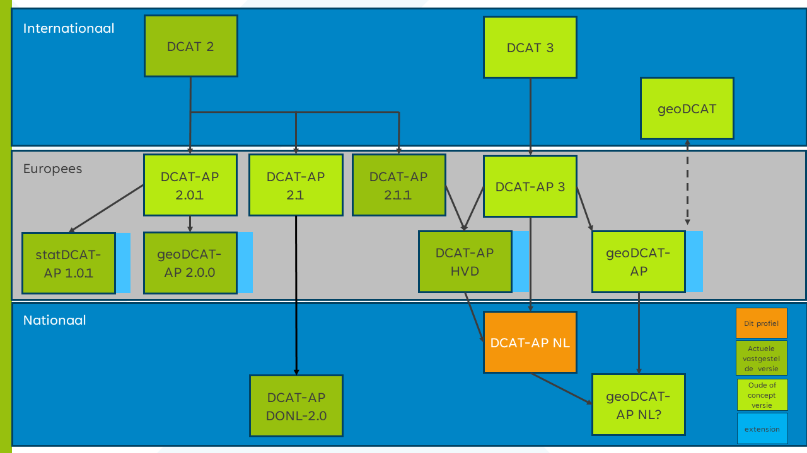

## Relatie andere profielen {#01CB11A8}
Dit profiel is een verdere specificatie van het toepassingsprofiel van de Europa [[DCAT-AP-3.0]]. Hierbij zijn aanpassingen gedaan op basis van ervaring met DCAT-AP-DONL 1.1, 2.0 en onderzoek en discussies in de werkgroep DCAT-AP-NL en is aansluiting gezocht bij metadata standaarden uit het geo en statistische domein. DCAT-AP-NL is compatible met [[DCAT-3.0]] en [[DCAT-AP-3.0]] .
<figure></img>
<figcaption>DCAT-AP-NL positionering, nog aanpassen met DCAT 3 als basis DCAT-AP-NL<i></i></figcaption></figure>

Om zoveel mogelijk scenario's te ondersteunen, verplichten de originele [[DCAT-3.0]] van het W3C en het toepassingsprofiel van de EU [[DCAT-AP-3.0]] weinig.
Op dit moment zijn [[DCAT-3.0]] en [[DCAT-AP-3.0]] als kandidaat release versie beschikbaar. Na het vaststellen van deze standaarden zal er gekeken worden of het DCAT-AP-NL profiel ook bijgewerkt moet worden.
