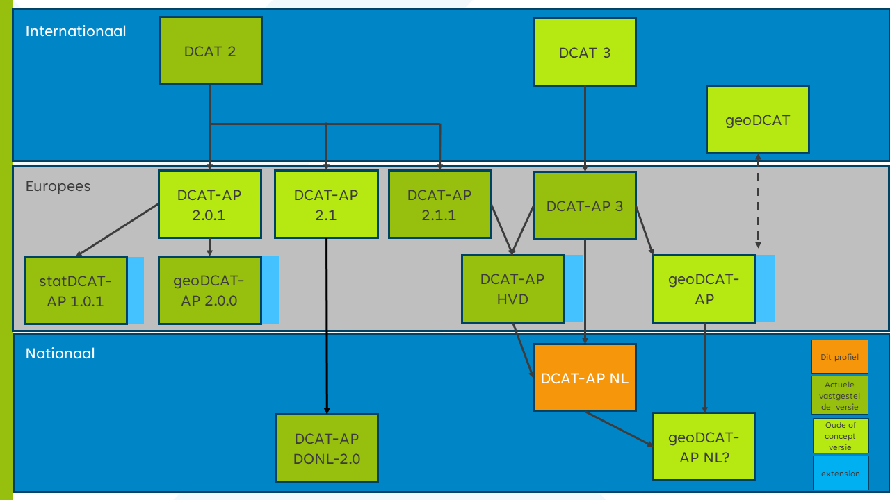

## Relatie andere profielen {#01CB11A8}
Dit profiel is een verdere specificatie van het Europese toepassingsprofiel [[DCAT-AP-3.0]]. Hierbij zijn aanpassingen gedaan op basis discussies in de werkgroep DCAT-AP-NL. Om zoveel mogelijk scenario's te ondersteunen, verplicht [[DCAT-3.0]] en het  Europese toepassingsprofiel [[DCAT-AP-3.0]] weinig. DCAT-AP-NL is compatible met [[DCAT-3.0]] en [[DCAT-AP-3.0]]. De aanvullingen voor High Value Data [[DCAT-AP-HVD]] zijn ook in dit profiel opgenomen. Op het Europese toepassingsprofiel [[DCAT-AP-3.0]] worden domein specifieke profielen ontwikkeld, zoals geoDCAT-AP en healthDCAT-AP, die meestal een verdere specificatie van eigenschappen en extra specifieke eigenschappen bevatten. Deze extra eigenschappen van domein specifieke Europese profielen zijn niet opgenomen in DCAT-AP-NL, deze kunnen aanvullend op DCAT-AP-NL worden toegepast. Eventueel kan er ook een Nederlands profiel op een Europes domein specifieke profiel worden ontwikkeld.

DCAT-AP-NL faciliteerd de uitwisseling van metadata tussen Nederlandse datacatalogi en EU datacatalogi. Daarmee vervangt het niet de domeinspecifieke standaarden zoals ISO 19115.  Vanuit domeinspecieke standaarden en profielen, zoals bijvoorbeeld INSPIRE, die gebaseerd is op ISO 19115, kunnen er profielen op DCAT worden ontwikkeld die ook een mapping van elementen bevat van de domein specifieke standaard naar DCAT. geoDCAT is daar een voorbeeld van.

<figure></img>
<figcaption>DCAT-AP-NL positionering<i></i></figcaption></figure>

Op dit moment zijn [[DCAT-3.0]] en [[DCAT-AP-3.0]] als kandidaat release versie beschikbaar. Na het vaststellen van deze standaard en  Europees toepassingsprofiel zal er gekeken worden of het DCAT-AP-NL profiel ook bijgewerkt moet worden.
