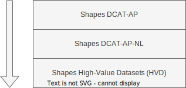

# Validaties DCAT-AP NL {#17C1E0BE}

Alle gegevensregels in dit profiel zijn ook uitgedrukt in SHACL. Met behulp van deze regels kan gevalideerd worden of een dataset beschrijving voldoet aan dit profiel.
 
 
De SHACL regels van DCAT-AP-NL bouwen voort op de SHACL regels uit [[DCAT-AP]]. Alle regels uit [[DCAT-AP]] zijn daarbij nog steeds van toepassing. DCAT-AP-NL scherpt enkel sommige gegevensregels aan.
 
 
In [[[#fig-verhouding-van-de-shapes-van-dcat-ap-dcat-ap-nl-en-high-value-datasets]]] is te zien hoe de shapes van DCAT-AP, DCAT-AP-NL en High-Value Datasets zich tot elkaar verhouden. Hierin is te zien dat DCAT-AP-NL gepositioneerd is tussen DCAT-AP en High-Value Datasets in, waarbij DCAT-AP de minst strenge eisen stelt en High-Value Datasets extra eisen kent.

Om te toetsen of een datasetbeschrijving voldoet aan DCAT-AP-NL is het ook noodzakelijk om zowel de DCAT-AP SHACL shapes als de DCAT-AP-NL SHACL shapes mee te nemen in de validatie. Mocht je een High-Value-Dataset-beschrijving willen valideren dan moet ook die set shapes extra worden meegenomen.
 
 
Om het valideren van de datasetbeschrijvingen zo goed mogelijk te ondersteunen, is in DCAT-AP de SHACL shapes opgesplitst om verschillende validatiescenario's en -aspecten te ondersteunen. Zie hiervoor het hoofdstuk <a data-cite="DCAT-AP-3.0#validation-of-dcat-ap">Validation of DCAT-AP</a>.

In navolging daarvan is in DCAT-AP-NL ook een splitsing gemaakt van de SHACL shapes. De SHACL shapes van DCAT-AP-NL zijn opgedeeld in de volgende bestanden, voor het valideren van verschillende aspecten van de datasetbeschrijvingen:
 
 
* [dcat-ap-nl-SHACL.ttl](./shapes/dcat-ap-nl-SHACL.ttl): De SHACL shapes van DCAT-AP-NL, exclusief de validatieregels rondom het klassebereik van eigenschappen.
* [dcat-ap-nl-SHACL-klassebereik.ttl](./shapes/dcat-ap-nl-SHACL-klassebereik.ttl): De SHACL shapes van DCAT-AP-NL voor het valideren van het klassebereik van eigenschappen, exclusief het klassebereik van eigenschappen met een waarde afkomstig uit een codelijst.
* [dcat-ap-nl-SHACL-klassebereik-codelijsten.ttl](./shapes/dcat-ap-nl-SHACL-klassebereik-codelijsten.ttl): De SHACL shapes van DCAT-AP-NL voor het valideren van het klassebereik van eigenschappen met een waarde afkomstig uit een codelijst.
  
 
Deze bestanden kunnen los, of gecombineerd worden gebruikt om de datasetbeschrijvingen te valideren.
 
 
Voor het valideren van aanbevolen shapes uit DCAT-AP-NL kan het volgende bestand worden toegevoegd bij de validatie:
 
 

* [dcat-ap-nl-SHACL-aanbevolen.ttl](./shapes/dcat-ap-nl-SHACL-aanbevolen.ttl): De SHACL shapes van DCAT-AP-NL voor het valideren van aanbevolen eigenschappen.
